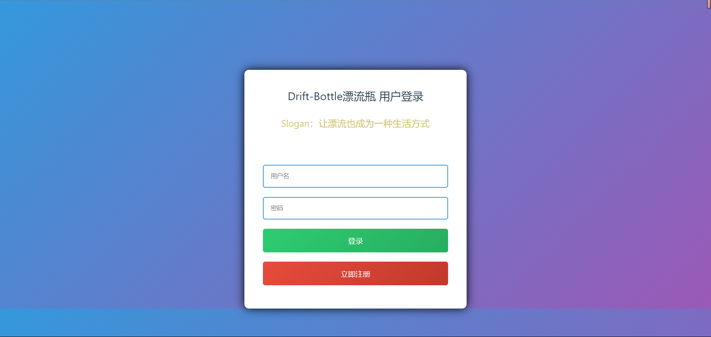
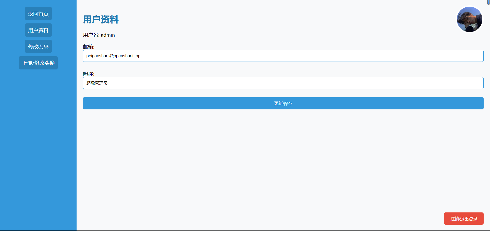

# 项目文档

## Slogan：让漂流也成为一种生活方式！

## 1. 项目概述

该项目是一个基于 Flask 框架的漂流瓶社交应用。用户可以通过注册、登录等功能提交自己的漂流瓶，也可以拾取其他用户提交的漂流瓶。用户可以查看自己提交的漂流瓶和拾取的漂流瓶，并进行一些个人信息管理操作，如修改密码、上传头像等。

**Demo地址：** [plp.openshuai.top](http://plp.openshuai.top)


## 2. 技术栈

- **Flask框架**: 用于构建Web应用。
- **MySQL数据库**: 存储用户信息、漂流瓶等数据。
- **PIL库**: 用于处理图像数据。
- **基本的前端技术**: 使用HTML、CSS、JavaScript，以及Flask提供的模板引擎。

## 3. 项目结构

项目包含以下主要文件：

- `app.py`: 应用的主文件，包含所有的路由和业务逻辑。
- `templates`文件夹: 存放HTML模板文件。
- `avatar`文件夹: 用于存放用户上传的头像。
- 其他静态文件：包括CSS文件等。
        3.1 templates文件夹
	templates文件夹下存放着应用的HTML模板文件，这些文件定义了网页的结构和布局，并通过Flask框架的模板引擎动态生成具体的页面内容。每个HTML文件对应一个或多个应用路由，定义了用户在浏览器中看到的界面。

	在该项目中，templates文件夹中的HTML文件主要用于以下几个功能：

	- 用户注册 (register.html)
	- 用户登录 (login.html)
	- 提交漂流瓶 (submit_bottle.html)
	- 查看自己提交的漂流瓶 (view_bottle.html)
	- 拾取漂流瓶后显示的页面 (picked_up_bottle.html)
	- 查看拾取的漂流瓶 (view_found_bottle.html)
	- 上传头像 (upload_avatar.html)
	- 查看用户个人资料 (user_profile.html)

## 4. 功能说明

### 4.1 用户注册功能

- 用户可以通过访问 `/register` 路由注册账户。
- 注册时需要提供用户名、密码和邮箱。
- 注册成功后将跳转到登录页面。

### 4.2 用户登录功能

- 用户可以通过访问 `/login` 路由登录账户。
- 登录时需要提供用户名和密码。
- 登录成功后将跳转到漂流瓶提交页面。

### 4.3 用户注销功能

- 用户可以通过访问 `/logout` 路由注销当前登录的账户。

### 4.4 提交漂流瓶功能

- 登录用户可以通过访问 `/submit_bottle` 路由提交漂流瓶。
- 提交时需要输入漂流瓶的消息内容。
- 提交成功后将跳转到查看漂流瓶页面。

### 4.5 拾取漂流瓶功能

- 登录用户可以通过访问 `/pick_up_bottle` 路由拾取其他用户的漂流瓶。
- 系统会从数据库中选择未拾取过的漂流瓶，用户可以随机拾取一个。
- 拾取成功后将显示漂流瓶的信息。

### 4.6 查看自己提交的漂流瓶功能

- 登录用户可以通过访问 `/view_bottle` 路由查看自己提交的漂流瓶。

### 4.7 查看拾取的漂流瓶功能

- 登录用户可以通过访问 `/view_found_bottle` 路由查看拾取的漂流瓶。

### 4.8 清空拾取的漂流瓶列表功能

- 登录用户可以通过访问 `/clear_found_bottles` 路由清空拾取的漂流瓶列表。

### 4.9 上传头像功能

- 登录用户可以通过访问 `/upload_avatar` 路由上传头像。
- 头像将以用户ID命名并保存在 `avatar` 文件夹中。

### 4.10 查看用户个人资料功能

- 登录用户可以通过访问 `/user_profile` 路由查看个人资料，包括用户名、邮箱、昵称和头像。

### 4.11 修改密码功能

- 登录用户可以通过访问 `/change_password` 路由修改密码。

### 4.12 修改个人资料功能

- 登录用户可以通过访问 `/update_profile` 路由修改个人资料，包括邮箱和昵称。

**演示截图:**







## 5. 数据库结构

项目使用MySQL数据库，包含以下表：

- `users`: 存储用户信息，包括用户名、密码、邮箱、头像等。
- `bottles`: 存储漂流瓶信息，包括消息内容、发送者ID等。
- `bottle_picks`: 存储用户拾取漂流瓶的记录，包括用户ID和漂流瓶ID。

## 6. 运行方式

在项目根目录下执行以下命令：

**一：编辑配置文件**

```bash
vim config.ini
[database]
host = 172.17.0.1     # 数据库地址
user = root           # 数据库用户
password = 123456     # 数据库用户密码
database = plp        # 数据库名称

[port]
listen_port = 5003    # 选择服务监听的本地端口
```

**二：运行应用程序**
```bash
python app.py
```

然后访问 [http://localhost:5003](http://localhost:5003) 即可使用漂流瓶应用。

## 7. 注意事项

- 请确保系统中已安装Flask、PIL等相关依赖。
- 请配置正确的数据库连接信息，包括数据库地址、用户名、密码等。

## 8. 后续改进计划

- 前端界面美化和交互优化。
  - 2024/01/09 更新第一版UI。
- 安全性增强，如密码加密存储。
  - 2024/01/11 已经更新实现。
- 日志记录和错误处理的完善。
- 性能优化，如数据库连接池的使用。

以上仅为初步建议，具体改进计划可根据实际需求和反馈进行调整。

